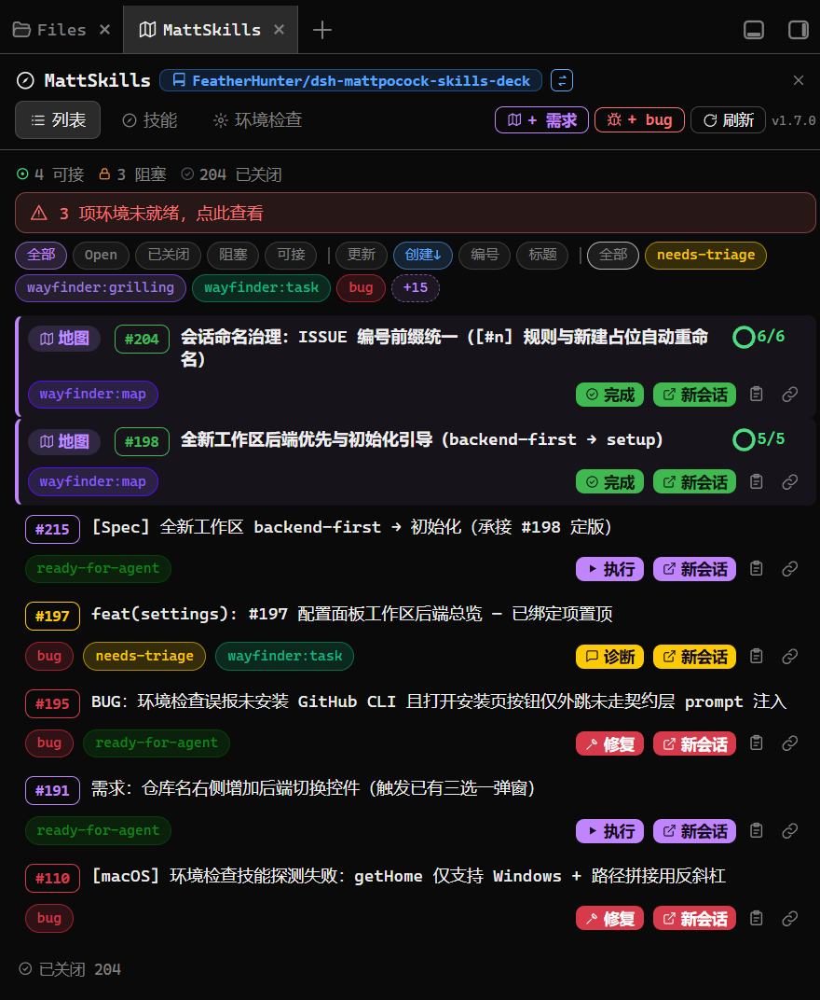
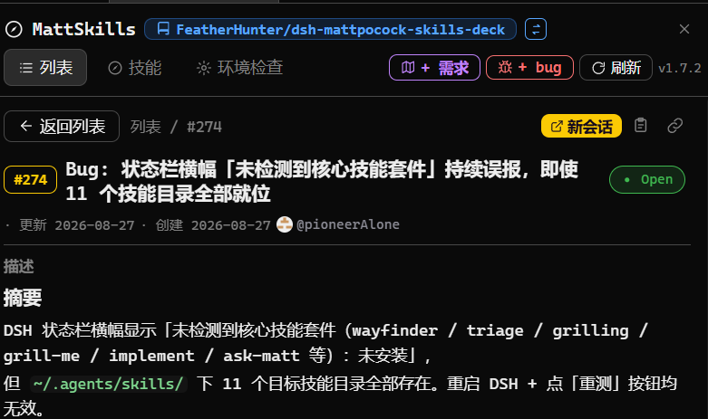
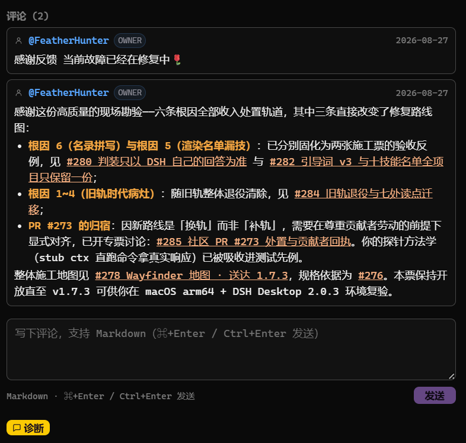
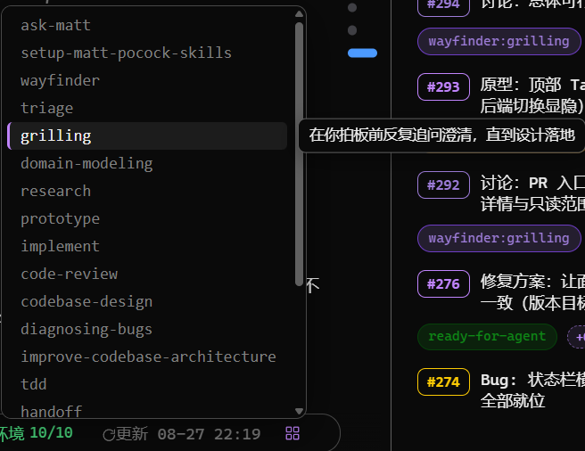

<h1 align="center">dsh-mattpocock-skills-deck</h1>

<div align="center">

**涓枃** 路 [English](docs/README.en.md)

**鎷ㄥ紑鎴樹簤杩烽浘鐪嬭缁堢偣锛屽墿涓嬬殑浜ょ粰 MattSkillsDeck銆?*  
璁?[mattpocock/skills](https://github.com/mattpocock/skills) 鍦?DSH 閲屽寲浣滀竴鍧楃湅寰楄銆佹淳寰楀姩鐨勪换鍔℃澘銆?
*Part the fog of war, see the end 鈥?MattSkillsDeck handles the rest.*

[](LICENSE) [](https://www.npmjs.com/package/dsh-mattpocock-skills-deck) [](https://github.com/FeatherHunter/dsh-mattpocock-skills-deck) [](https://github.com/mattpocock/skills)



<strong>涓€鍧楃湅寰楄銆佹淳寰楀姩鐨勪换鍔℃澘銆?/strong>

**瑁呭畠锛?0 绉掋€?*

</div>

<h2 align="center"><sub>INSTALL</sub><br>瀹夎</h2>

<div align="center">

鍓嶇疆鍙湁涓€涓細[DSH](https://www.npmjs.com/package/@deepseek-ai/dsh)锛圖eepSeek Harness锛夈€傚湪 DSH 閲岋紝浣犱笅鎸囦护銆丄I 骞叉椿锛汳attSkillsDeck 鎶婅繖浜涙椿鍙樻垚闈㈡澘涓婄殑浠诲姟銆?
</div>

```bash
# 鈶?瀹夎 DSH CLI锛堝凡瑁呰烦杩囷級
npm install -g @deepseek-ai/dsh

# 鈶?绐勫睆鏇村ソ鐢紙鍙€夛級锛氶厤涓?better-sidebar 骞舵帓鐪嬫洿鑸掓湇
dsh plugin --profile web add dsh-better-sidebar

# 鈶?瀹夎 MattSkillsDeck
dsh plugin --profile web add dsh-mattpocock-skills-deck
# 閿佸畾鏈€鏂扮増鏇寸ǔ锛堝綋鍓?1.7.6锛夛細
# dsh plugin --profile web add dsh-mattpocock-skills-deck@1.7.6 --registry https://registry.npmjs.org
```

<div align="center">

鍒锋柊鍗崇敓鏁堬紝闆堕厤缃€?
</div>

<details>
<summary>绐勫睆鏇村ソ鐢紵閰嶄釜 better-sidebar</summary>

鎺ㄨ崘鎼厤 better-sidebar锛氬湪 VSCode 椋庢牸鐨勪晶杈规爮閲屽苟鎺掓煡鐪嬪垪琛ㄤ笌璇︽儏锛屼綋楠屾洿浣炽€?
```bash
dsh plugin --profile web add dsh-better-sidebar
```

</details>

<details>
<summary>鎶婂畨瑁呬氦缁欎綘鐨?AI</summary>

澶嶅埗涓嬮潰杩欐鍙戠粰浣犵殑 AI锛屽畠浼氳浠撳簱銆佹鏌ョ幆澧冦€佹寜闇€瀹夎锛?
```text
璇峰府鎴戝畨瑁?DeepSeek Harness 鎻掍欢 dsh-mattpocock-skills-deck锛圡attSkillsDeck锛夈€?鍏堣浠撳簱 README锛歨ttps://github.com/FeatherHunter/dsh-mattpocock-skills-deck
鐒跺悗鑷妫€鏌ョ幆澧冨苟鎸夐渶瀹夎锛堝凡瑁呯殑璺宠繃锛夛紝瀹屾垚鍚庣畝瑕佹眹鎶ョ粨鏋溿€?```

</details>

<details>
<summary>鍏嶅叏灞€瀹夎 / 鏇存柊涓嶇敓鏁堟椂鎬庝箞瑁?/summary>

```bash
# 缁欏畾鏈€鏂扮増鏈彿瀹夎
dsh plugin --profile web add dsh-mattpocock-skills-deck@1.7.6 --registry https://registry.npmjs.org

# 鍏嶅叏灞€瀹夎锛堟兂鏇寸ǔ锛屽儚涓婇潰涓€鏍烽攣鐗堟湰锛?npx --yes @deepseek-ai/dsh plugin --profile web add dsh-mattpocock-skills-deck

# 鏇存柊琚潤榛樺拷鐣ユ椂锛屾樉寮忔寚瀹氬畼鏂规簮
dsh plugin --profile web add dsh-mattpocock-skills-deck@latest --registry https://registry.npmjs.org
```

</details>

鍗囩骇 路 鍗歌浇锛?
```bash
dsh plugin --profile web update dsh-mattpocock-skills-deck   # 鍗囩骇
dsh plugin --profile web remove dsh-mattpocock-skills-deck   # 鍗歌浇
```

<h2 align="center"><sub>WHY</sub><br>涓轰粈涔堣鍋?MattSkillsDeck</h2>

<div align="center">

Matt Pocock 鐨?[skills 濂椾欢](https://github.com/mattpocock/skills)閲岋紝wayfinder 闈炲父寮哄ぇ锛氳兘鐢诲嚭涓€寮犲湴鍥撅紝甯︿綘绌胯繃杩烽浘锛屾姷杈剧粓鐐广€備絾鏄紝**浣犺剼涓嬬殑姣忎竴姝ヨ濡備綍璧板憿锛?*

MattSkillsDeck 鍦ㄥ湴鍥句箣涓婂姞浜嗕竴灞備换鍔＄郴缁燂細

**涓€鍧楃湅寰楄鐨勪换鍔℃澘** 鈥斺€?浠撳簱閲岀殑 ISSUE 涓嶅啀鏄祦姘磋处锛歁attSkillsDeck 鎶婂畠浠惉杩?DSH 渚ц竟鏍忥紝鍙帴銆侀樆濉炪€佸凡鍏抽棴鍚勫綊鍚勪綅锛岃繘搴︾幆璧板埌鍝竴鏍硷紝涓€鐪肩湅娓?
**涓€涓細骞叉椿鐨勬搷浣滃彴** 鈥斺€?姣忓紶浠诲姟鍗℃湰韬氨鏄寜閽細璇婃柇銆佷慨澶嶃€佹墽琛屻€佹柊浼氳瘽锛岀偣涓€涓嬶紝AI 灏卞幓骞叉椿锛涘共鍒板摢涓€姝ャ€佸崱鍦ㄥ摢閲岋紝鍗′笂鍐欏緱娓呮竻妤氭

鍦板浘绠＄粓鐐癸紝MattSkillsDeck 绠¤剼涓嬨€?


<strong>DSH 搴曢儴鐨勪换鍔℃爮锛氬彲鎺ャ€侀樆濉炪€佹矇娣€銆佷氦鎺ワ紝鍏ㄥ湪杩欎竴鏉°€?/strong>

</div>

<h2 align="center"><sub>IN ACTION</sub><br>鐪熸満婕旂ず</h2>

<div align="center">



<strong>鐐瑰紑涓€涓?ISSUE锛氭弿杩般€佷綔鑰呫€佷竴閿柊浼氳瘽銆?/strong>



<strong>涓嶅姩缁堢锛氬湪闈㈡澘閲岀洿鎺ヨ瘎璁恒€佸搷搴?ISSUE銆佽窇璇婃柇銆?/strong>



<strong>鐘舵€佹爮鏈€鍙充晶锛歁att 鎶€鑳藉浠朵竴閿洿杈俱€?/strong>

Matt 鐨?skills 瀹樼綉锛堟枃妗ｄ笌鏁欑▼锛夛細[aihero.dev/skills](https://www.aihero.dev/skills)

</div>

<h2 align="center"><sub>FAQ</sub><br>甯歌闂</h2>

<details open>
<summary>鏇存柊涔嬪悗杩樻槸鏃х増鏈紵</summary>

杩欐槸 DSH 妗岄潰绔殑 pnpm 渚涘簲閾剧瓥鐣ワ紙`minimumReleaseAge`锛夊鑷寸殑锛氬垰鍙戝竷鐨勭増鏈紝鍑犱釜灏忔椂鍐?`dsh plugin update` 鍜屾彃浠跺競鍦虹殑銆屾洿鏂般€嶆寜閽兘浼氶潤榛樿烦杩囥€傛洿鏂板悗璇峰畬鍏ㄩ€€鍑?DSH 鍐嶉噸寮€锛屾寜 Ctrl+F5 鍒锋柊椤甸潰锛涜繕娌℃洿鏂扮殑璇濓紝鏄惧紡鎸囧畾瀹樻柟婧愯涓€娆★細

```bash
dsh plugin --profile web add dsh-mattpocock-skills-deck@latest --registry https://registry.npmjs.org
```

</details>

<details>
<summary>涓嶈 better-sidebar锛岀獎灞忚兘鐢ㄥ悧锛?/summary>

鑳姐€備换鍔″垪琛ㄥ湪涓婚潰鏉匡紝璇︽儏璧板彸渚у垪锛涢渶瑕佸苟鎺掑鐓ф椂鍐嶈 better-sidebar 灏辫銆?
</details>

<h2 align="center"><sub>ARCHITECTURE</sub><br>鏋舵瀯</h2>

<div align="center">

鎯崇湅浠ｇ爜鏄€庝箞缁勭粐鐨勶紵杩欎唤鍙氦浜掓灦鏋勫浘鐢?AI 鐢熸垚锛屾妸鏁翠綋缁撴瀯銆佹暟鎹祦涓庡叧閿姸鎬侀兘鐢诲嚭鏉ヤ簡锛屾敮鎸佹繁鑹蹭笌娴呰壊涓婚鍒囨崲锛屼篃鑳藉鍑轰负鍥剧墖銆?
[鍦ㄧ嚎棰勮锛堟帹鑽愶級](https://featherhunter.github.io/dsh-mattpocock-skills-deck/architecture/MattSkills-architecture.html) 路 鏈湴鍏嬮殕鍚庣洿鎺ユ墦寮€ [`docs/architecture/MattSkills-architecture.html`](docs/architecture/MattSkills-architecture.html) 涔熻兘鐪嬶紝鏃犻渶璧锋湇鍔°€傛簮鏁版嵁鍦ㄥ悓鐩綍鐨?`mattskills.architecture.json`锛屾洿澶氭枃瀛楄鏄庡湪鍚岀洰褰曠殑 `*.md` 鏂囦欢閲屻€?
</div>

<h2 align="center"><sub>DEVELOPMENT</sub><br>寮€鍙?/h2>

鏀逛唬鐮佸彧鏀?`src/`锛涙牴鐩綍鐨?`client.js`銆乣host.js` 涓?`package/lib/` 閮芥槸鏋勫缓浜х墿锛屽埆鎵嬫敼銆?
```bash
node scripts/build.mjs      # 鏋勫缓
npm run test:smoke          # 鍐掔儫娴嬭瘯
npm run verify              # 濂戠害楠岃瘉
bash scripts/build.sh       # 鏋勫缓 + 鍚屾鍒板凡瑁呯殑 DSH
```

鏋勫缓 / 楠岃瘉 / 鍚屾 / 鍙戝竷鐨勫畬鏁存祦绋嬭 [DEV-WORKFLOW.md](DEV-WORKFLOW.md)銆?
<h2 align="center"><sub>MORE</sub><br>浣滆€呯殑鍏朵粬浣滃搧</h2>

<div align="center">

鍠滄杩欎釜鎻掍欢鐨勮瘽锛岃繖浜涘彲鑳戒綘涔熺敤寰椾笂锛?
**[dsh-opencode-palette](https://github.com/FeatherHunter/dsh-opencode-palette)** 鈥斺€?34 娆?opencode 缁忓吀閰嶈壊涓€閿崲瑁?DSH锛屽嵆鐐瑰嵆鎹紝閲嶅惎涓嶄涪

**[dsh-prompt](https://github.com/FeatherHunter/dsh-prompt)** 鈥斺€?Prompt 宸ュ叿绠憋細24 鏉℃繁搴︽ā鏉块殢鎵嬬偣锛屽埆鍐嶅鍒剁矘璐?
**[dsh-chinese-skill-patch](https://github.com/FeatherHunter/dsh-chinese-skill-patch)** 鈥斺€?璁?DSH 鐩存帴鐢ㄤ腑鏂囨妧鑳藉悕锛氳緭鍏?/绉?灏辫兘鐩磋揪銆岀瀹跺ぇ鍘ㄣ€嶏紝鎶€鑳戒笉蹇呮敼鑻辨枃鍚?
---

鏈夐棶棰樸€佹湁鎯虫硶锛焄鎻愪氦 ISSUE](https://github.com/FeatherHunter/dsh-mattpocock-skills-deck/issues)锛屾垨鍒?[璁ㄨ鍖篯(https://github.com/FeatherHunter/dsh-mattpocock-skills-deck/discussions)鑱婅亰

涓汉浣滃搧锛屼笌 [mattpocock/skills](https://github.com/mattpocock/skills) 瀹樻柟娌℃湁鍏崇郴銆?MIT 漏 FeatherHunter

</div>

<h2 align="center"><sub>THANKS</sub><br>鑷磋阿</h2>

<div align="left">

鎰熻阿姣忎竴浣嶆彁浜?Issue銆丳R 涓庡弬涓庤璁虹殑鏈嬪弸锛屾槸浣犱滑璁╄繖涓彃浠朵竴鐐圭偣鍙樺ソ銆?
[@pioneerAlone](https://github.com/pioneerAlone) 鈥?鍙嶉浜?#298锛坉etails/better-sidebar 閲嶅锛岄檮瀹屾暣澶嶇幇涓庢埅鍥撅級銆?274銆?234 绛夌姸鎬佹爮涓庡仴搴锋鏌ヨ鎶ワ紝骞舵彁浜や簡淇 PR #273銆?316锛屾劅璋綘璁┿€岄噸瑁呭悗鍒板寮傚父銆嶇殑浣撴劅寰椾互涓€娆℃竻鐖戒慨澶?馃尮

[@Shimmernight](https://github.com/Shimmernight) 鈥?鎻愪氦浜?#277 绛?Issue锛屼互鍙?PR #287銆?275銆?106锛坱oast 涓婚銆佸懡鍚嶄慨姝ｃ€乵acOS 閫傞厤锛?
[@21967201](https://github.com/21967201) 鈥?鎻愪氦浜?PR #321锛堝畬鍠?triage + wayfinder 鏍囩鏂囨。锛?
[@angenet](https://github.com/angenet) 鈥?鍙嶉浜?#295銆?262 绛?macOS 鐜妫€娴嬮棶棰?
[@hyperion2144](https://github.com/hyperion2144) 鈥?鍙嶉浜?#110 绛夌幆澧冩鏌ラ棶棰?
涔熸劅璋㈠湪璇勮鍖轰笌璁ㄨ鍖虹暀涓嬫兂娉曠殑姣忎竴浣嶆湅鍙嬨€傚鏋滀綘涔熼亣鍒颁簡闂鎴栨湁鏂版兂娉曪紝娆㈣繋鐩存帴鎻?Issue 鎴栧彂璧疯璁恒€?
</div>

<h2 align="center"><sub>CONNECT</sub><br>鍔犲叆鎴戜滑</h2>

<div align="center">

鎵爜鍔犲叆璇濋缇も€斺€斾簩缁寸爜姘镐箙鏈夋晥銆傛棩甯搁棽鑱婁笌蹇€熺瓟鐤戣蛋缇ら噷锛孊ug 涓庨渶姹傝鐩存帴鎻?ISSUE锛屾洿楂樻晥鍙拷婧€?

<br>
<strong>鍔犲叆璇濋缇?/strong>
<br>
<sub>dsh-mattpocock-skills 路 璇ヤ簩缁寸爜姘镐箙鏈夋晥</sub>

</div>

<h2 align="center"><sub>STAR HISTORY</sub><br>Star History</h2>

<div align="center">

<a href="https://featherhunter.github.io/dsh-mattpocock-skills-deck/star-history.html">View Star History (Interactive)</a>

</div>

