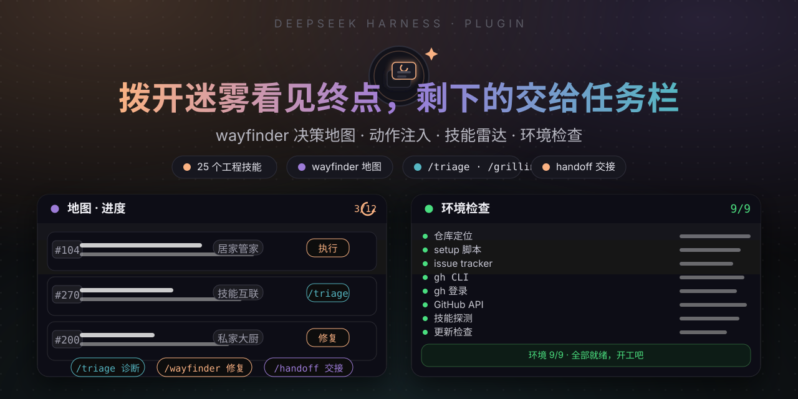
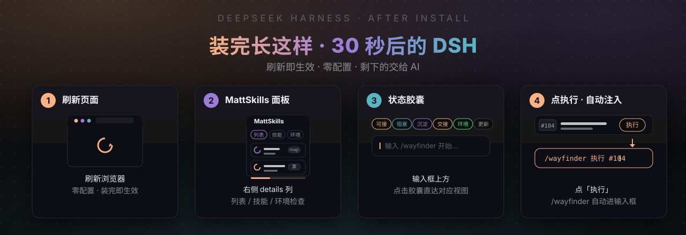
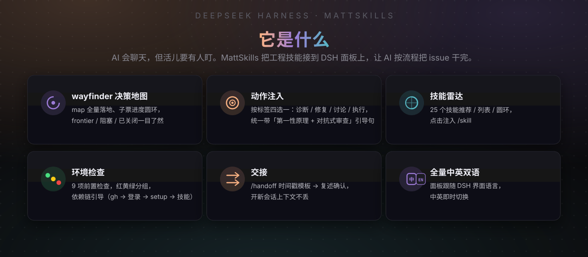
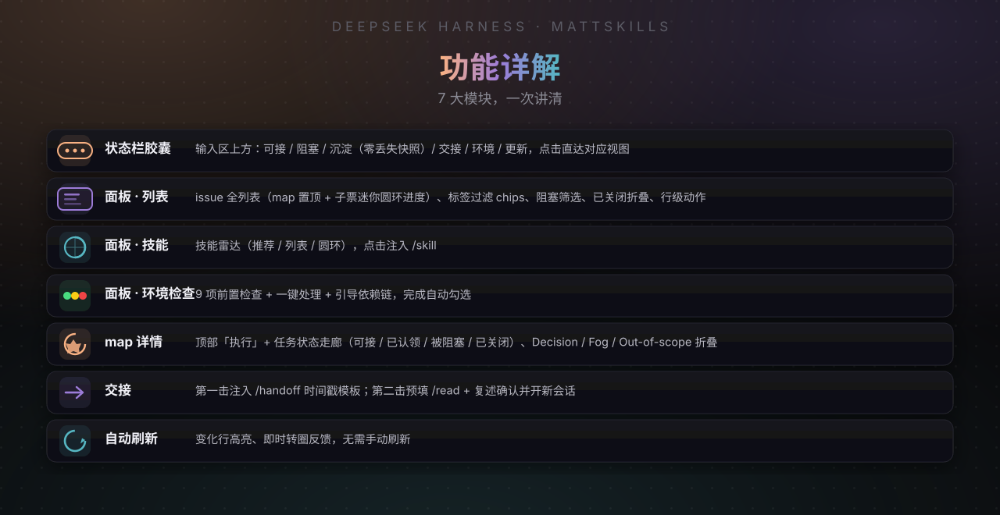
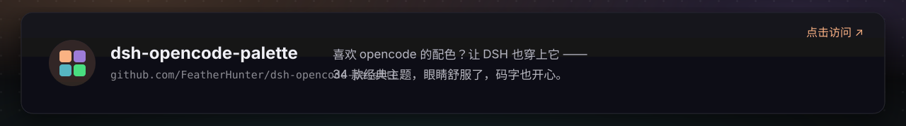
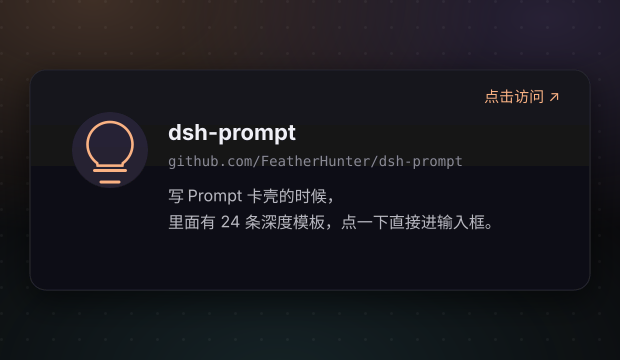

# 🧠 dsh-mattpocock-skills-deck

**让 AI 不只是聊天，还能把事办成 —— [mattpocock/skills](https://github.com/mattpocock/skills) 技能套件的 DSH 控制面板（MattSkills）。**

[](LICENSE)
[](https://www.npmjs.com/package/dsh-mattpocock-skills-deck)
[](https://github.com/FeatherHunter/dsh-mattpocock-skills-deck)
[](https://github.com/mattpocock/skills)



> 装它，30 秒。剩下的交给 AI。

## 🚀 装它（30 秒）

```bash
npm install -g @deepseek-ai/dsh        # 首次装 CLI
dsh plugin --profile web add dsh-mattpocock-skills-deck
```



刷新即生效，零配置 —— 剩下的交给 AI。

免全局安装：`npx --yes @deepseek-ai/dsh plugin --profile web add dsh-mattpocock-skills-deck`

升级 / 卸载：`dsh plugin --profile web update|remove dsh-mattpocock-skills-deck`



> 非官方：本项目是 Matt Pocock Skills 的第三方配套工具，与 mattpocock/skills 无隶属关系。

## 📖 功能详解



完整使用说明见 [package/README.md](package/README.md)；设计定稿见 [DESIGN.md](DESIGN.md)；变更历史见 [CHANGELOG.md](CHANGELOG.md)。

## 💛 作者的其他作品

喜欢这个插件的话，这些可能你也用得上：

<p align="center">
  <a href="https://github.com/FeatherHunter/dsh-opencode-palette"></a>
  &nbsp;&nbsp;
  <a href="https://github.com/FeatherHunter/dsh-prompt"></a>
</p>

## License

MIT © FeatherHunter
