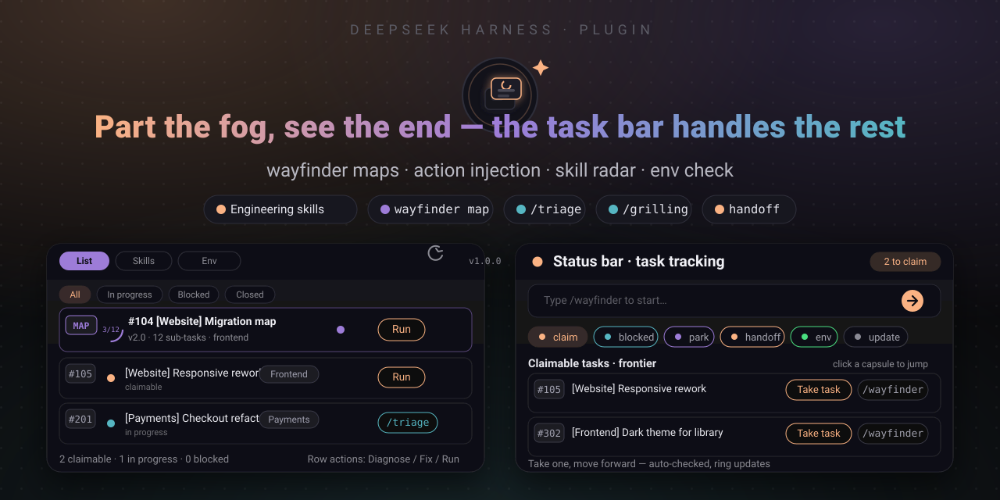
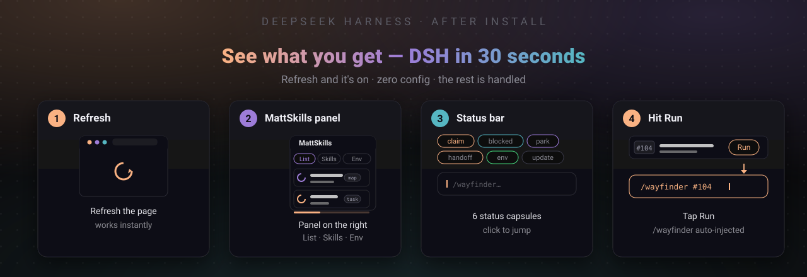
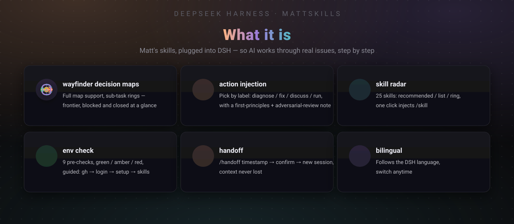
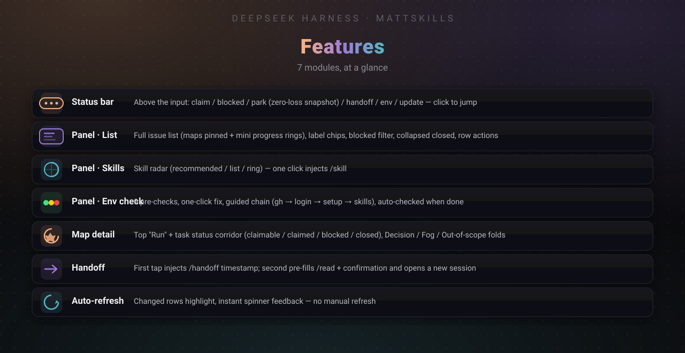
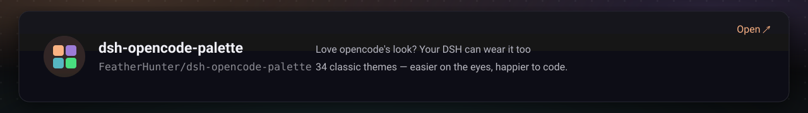
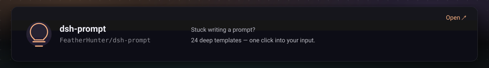

# 🧠 dsh-mattpocock-skills-deck

**🌐 [中文](../README.md) · [English](README.en.md)**

**Part the fog, see the end — the task bar handles the rest. Plug [mattpocock/skills](https://github.com/mattpocock/skills) into DSH as a game-like mission system (MattSkills).**

[](../LICENSE)
[](https://www.npmjs.com/package/dsh-mattpocock-skills-deck)
[](https://github.com/FeatherHunter/dsh-mattpocock-skills-deck)
[](https://github.com/mattpocock/skills)



> Install it — 30 seconds. The task bar handles the rest.

## 🚀 Install it (30 seconds)

Three commands, each copyable on its own — skip anything you've already installed:

**① Install the DSH CLI (first time only)**

```bash
npm install -g @deepseek-ai/dsh
```

**② Optional but recommended: better-sidebar (skip if installed)**

```bash
dsh plugin --profile web add dsh-better-sidebar
```

> 💡 The panel looks best inside [dsh-better-sidebar](https://github.com/omdsh-dev/DSH-better-sidebar)'s VSCode-style sidebar (side-by-side list & detail). It still works without it (right details column), just a bit tighter on narrow screens.

**③ Install MattSkills** — latest `v1.7.3` (`npm view` verified)

```bash
dsh plugin --profile web add dsh-mattpocock-skills-deck
# or pin latest: dsh plugin --profile web add dsh-mattpocock-skills-deck@1.7.3 --registry https://registry.npmjs.org
```

**④ Or let your AI do it** — copy the prompt below to your AI; it reads the repo, checks your environment, and installs only what's missing (it skips what's already there):

```text
Please help me install the DeepSeek Harness plugin dsh-mattpocock-skills-deck (MattSkills).
First read the repo README: https://github.com/FeatherHunter/dsh-mattpocock-skills-deck
Then check the environment and install what's missing (skip what's already installed), and give a brief summary when done.
```



Refresh and it's on — zero config, and the rest is handled. Latest `v1.7.3` — https://www.npmjs.com/package/dsh-mattpocock-skills-deck

Without a global install: `npx --yes @deepseek-ai/dsh plugin --profile web add dsh-mattpocock-skills-deck` // latest `v1.7.3`

Update / remove: `dsh plugin --profile web update|remove dsh-mattpocock-skills-deck`

> **⚠️ Still showing the old version after update? (DSH platform issue, not a bug in this plugin)**
> This is caused by **DSH Desktop's** `pnpm` supply-chain policy `minimumReleaseAge` — freshly published versions are **silently ignored** by `dsh plugin update` / the Plugin Market's "Update" button (`pnpm update` shows no error but doesn't update, wait a few hours). **Please fully quit DSH and reopen it, then hard-refresh the page (Ctrl+F5)** to see the new version (e.g. `v1.7.3`). If you just published and the update still doesn't take effect, run explicitly:
> ```bash
> dsh plugin --profile web add dsh-mattpocock-skills-deck@latest --registry https://registry.npmjs.org
> ```
> or retry after a few hours. This is a DSH platform behavior, reproduced as `pnpm update` → `Packages: -2` still `1.0.0`; `pnpm add @1.7.3` → `Added 1` succeeds.

## 🎮 The idea

Matt Pocock's skills are excellent: wayfinder draws a **map** that parts the fog and shows the end. But a map only shows you where the end is — someone still has to walk every step.

MattSkills adds a **task system** on top of the map, turning the skills into a game-like mission console inside DSH:

- **Claim tasks** — every playable point on the map is a "claim" task; tap to take it
- **Move forward** — finish one sub-task, the progress ring advances, the next task appears
- **Save & hand off** — mark "blocked" when stuck; "park" takes a zero-loss snapshot; hand off to keep context when you switch sessions

The fog is still there — but now you have a map and a task bar.

> Unofficial: this project is a third-party companion to Matt Pocock Skills, with no affiliation to mattpocock/skills.



## 📖 Features



Full docs: [package/README.md](../package/README.md) · Design: [DESIGN.md](../DESIGN.md) · Changelog: [CHANGELOG.md](../CHANGELOG.md)

## 💛 More from the author

If you like this plugin, you might also like:

[](https://github.com/FeatherHunter/dsh-opencode-palette)

[](https://github.com/FeatherHunter/dsh-prompt)

## License

MIT © FeatherHunter