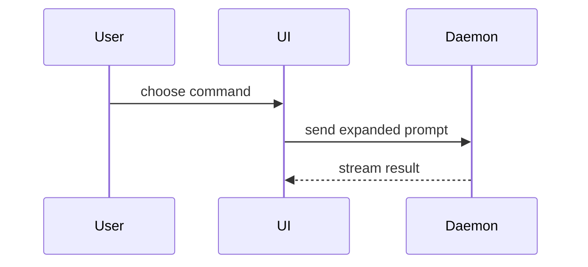

写拉取请求正文时用这个模板：

```markdown
## Summary

<diagram, diff-sketch, or tree>

## Evidence

- **Before:** <screenshot/output/failing test run>
  **After:** <screenshot/output/passing test run>

## Merge Danger

**Door:** <one-way or two-way>

<optional: description>

**Blast Radius:** <one-word description>

<optional: potential ramifications of merge>
```

## 各部分

跳过所有开场白，行文保持简短。使用用户 `GLOSSARY.md` 里的领域语言。

### 摘要

挑最小的那个视图，让要点清楚。

- 逻辑或算法用伪代码展示：

```text
on(save)
  if content is unchanged
    return cached result
  write new content
  return fresh result
```

- 运行时控制流用调用树展示：

```text
submitForm
  createSession
    persistPrompt
    launchAgent
  navigateToSession
```

- UI 结构用组件树展示，把要紧的状态和模块边界一并标出：

```text
<SessionPage> (apps/example/src/routes/session.tsx)
  useSessionEvents()
  <SessionToolbar>
    <RunSkillButton> (packages/ui)
```

- 文件职责或大范围重构用浅文件树展示：

```text
src/
├── commands/       # parses user actions
├── sessions/       # owns session state
└── transport/      # sends API requests
```

- 组件交互、控制流或数据流用 Mermaid 展示：



- 当重点是“改了什么”、而周围的形状已经存在时，用 `diff`。把 diff 的形状和主题对上。

组件改动：

```diff
 <SessionPage>
   useSessionEvents()
   <SessionToolbar>
+    <RunSkillButton />
   <SessionTimeline>
+    <SkillResultCard />
```

文件布局改动：

```diff
 src/
 ├── commands/
+│   └── show-me.ts       # expands the slash command
 ├── sessions/
-└── transport.ts
+└── transport/
+    ├── client.ts
+    └── stream.ts
```

调用树或调用栈改动：

```diff
 submitForm
   createSession
     persistPrompt
+    expandSkillMention
     launchAgent
-  navigateToSession
+  navigateToSession
+    subscribeToEvents
```

状态或控制流改动：

```diff
 on(save)
-  write content
+  if content is unchanged
+    return cached result
+  write new content
+  invalidate cache
```

- 当大部分内容都是新的、省略上下文会藏起归属或顺序、或者用户需要一个能直接复制过去的目标形状时，把整块都展示出来：

```ts
function expandSkill(command: string): string {
  const skillName = command.slice(1);
  return `use the ${skillName} skill`;
}
```

#### 指引

把每一处视觉元素放在它所支撑的那小段文字旁边。只保留回答用户当前问题、或解决当前讨论点的选项所必需的调用、文件、属性、状态和边界。

这些形式你可能只用其中一种，也可能用好几种，但不太可能全用上。自己拿捏，别把用户淹了。

### 证据

具体证据，证明改动是有效的。展示前与后。

截图是 S 级——当环境已经为此搭好、而且改动是视觉上的时候。

基于执行的证据是 A 级。测试结果、控制台输出。用伪代码展示那条现在失败、之后通过的测试。

### 合并风险

说明这是一扇单向门还是双向门。双向门你可以走回去，单向门不行。回滚代价低的拉取请求风险更低。涉及破坏性操作或难以逆转的决定的改动，都是单向门。

爆炸半径是这次拉取请求引入的改动可能造成的影响或波及范围。把所有可能都考虑进来。例子有布局偏移、对使用方的破坏、移动端响应式等。
